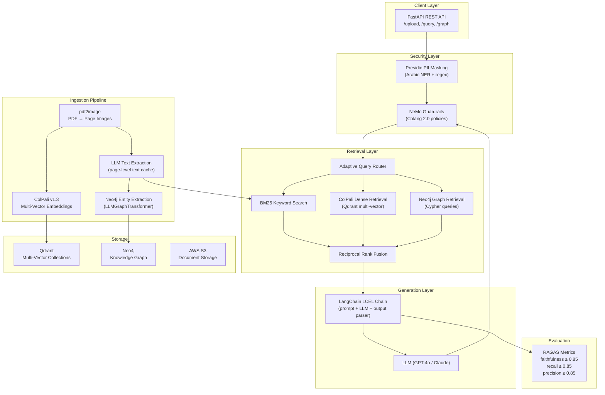

# LexisGraph — Enterprise Legal Arabic Document Intelligence System

An enterprise-grade legal AI system specializing in Arabic document understanding using OCR-free parsing (ColPali), multi-vector Qdrant retrieval, Neo4j knowledge graphs, and Presidio/NeMo security — fully deployed to AWS.

## MVB (Minimum Viable Build) Strategy

We follow a phased MVB approach: build the smallest end-to-end working system first, then iteratively harden, scale, and enrich it. Each phase is self-contained and deployable.

| Phase | Focus | Deliverable |
|-------|-------|-------------|
| **Phase 1** | Foundation & Core Pipeline | PDF → ColPali embeddings → Qdrant → LLM answer |
| **Phase 2** | Hybrid Retrieval & Knowledge Graph | BM25 + Dense + RRF + Neo4j entity graph |
| **Phase 3** | Security & Guardrails | Presidio PII masking + NeMo Guardrails |
| **Phase 4** | Evaluation & Adaptive Routing | RAGAS metrics + intelligent query routing |
| **Phase 5** | Production AWS Deployment | Docker + ECS Fargate + auto-scaling + monitoring |

---

## Architecture Overview



---

## Architectural Decisions & Specifications

> [!NOTE]
> **Decisions Finalized**:
> 1. **Primary LLM Provider**: **Groq** (`langchain-groq`, e.g., `llama-3.3-70b-versatile` for reasoning/chains and `llama-3.2-11b-vision-preview` / `llama-3.2-90b-vision-preview` for vision/extraction tasks, with OpenAI fallback support).
> 2. **Environment & Deployment Mode**: **Local Docker Compose** (Qdrant + Neo4j + FastAPI App) for development and testing.
> 3. **Document Scope**: **General Arabic Legal Documents** (commercial & employment contracts, court rulings, legislative articles).
> 4. **Arabic NER / PII Engine**: **Hybrid Presidio** (Regex + spaCy `xx_ent_wiki_sm`) with LLM-assisted contextual verification.
> 5. **Embedding Inference Hardware**: **Auto-detect CUDA GPU with seamless CPU fallback**.
> 6. **Cloud & Infrastructure Scope**: **Full standalone CloudFormation and production Docker Compose templates**.


---

## Proposed Changes

### Phase 1: Foundation & Core Pipeline

The core end-to-end loop: upload a PDF → convert pages to images → embed with ColPali → store in Qdrant → query → retrieve → answer.

---

#### Project Structure

```
lexisgraph/
├── docker-compose.yml              # Local dev: Qdrant + Neo4j + App
├── Dockerfile                       # Multi-stage Python app image
├── pyproject.toml                   # Dependencies (uv/pip)
├── .env.example                     # Required environment variables
├── README.md                        # Setup & usage guide
│
├── app/
│   ├── __init__.py
│   ├── main.py                      # FastAPI application entry point
│   ├── config.py                    # Settings via pydantic-settings
│   │
│   ├── api/
│   │   ├── __init__.py
│   │   ├── routes/
│   │   │   ├── __init__.py
│   │   │   ├── documents.py         # /upload, /documents, /documents/{id}
│   │   │   ├── query.py             # /query
│   │   │   ├── graph.py             # /graph/entities, /graph/relationships
│   │   │   └── health.py            # /health, /ready
│   │   └── middleware/
│   │       ├── __init__.py
│   │       └── security.py          # PII + NeMo middleware
│   │
│   ├── core/
│   │   ├── __init__.py
│   │   ├── ingestion/
│   │   │   ├── __init__.py
│   │   │   ├── pdf_processor.py     # pdf2image page extraction
│   │   │   ├── colpali_embedder.py  # ColPali multi-vector embedding
│   │   │   └── text_extractor.py    # LLM-based text extraction from images
│   │   │
│   │   ├── retrieval/
│   │   │   ├── __init__.py
│   │   │   ├── qdrant_store.py      # Qdrant multi-vector operations
│   │   │   ├── bm25_store.py        # BM25 keyword index
│   │   │   ├── hybrid_retriever.py  # RRF fusion logic
│   │   │   └── query_router.py      # Adaptive path selection
│   │   │
│   │   ├── knowledge_graph/
│   │   │   ├── __init__.py
│   │   │   ├── neo4j_client.py      # Neo4j connection + CRUD
│   │   │   ├── entity_extractor.py  # LLMGraphTransformer wrapper
│   │   │   └── graph_retriever.py   # Cypher-based retrieval
│   │   │
│   │   ├── generation/
│   │   │   ├── __init__.py
│   │   │   ├── chain.py             # LangChain LCEL RAG chain
│   │   │   └── prompts.py           # Arabic-aware prompt templates
│   │   │
│   │   └── security/
│   │       ├── __init__.py
│   │       ├── presidio_service.py  # PII detection & masking
│   │       └── nemo_config/         # NeMo Guardrails config dir
│   │           ├── config.yml
│   │           ├── prompts.yml
│   │           └── rails.co         # Colang 2.0 policies
│   │
│   └── models/
│       ├── __init__.py
│       ├── schemas.py               # Pydantic request/response models
│       └── entities.py              # Legal entity types
│
├── evaluation/
│   ├── __init__.py
│   ├── ragas_evaluator.py           # RAGAS evaluation runner
│   ├── test_dataset.json            # Evaluation dataset
│   └── benchmark.py                 # Benchmark script
│
├── infrastructure/
│   ├── aws/
│   │   ├── ecs-task-definition.json # ECS Fargate task def
│   │   ├── cloudformation.yml       # Full AWS stack (or Terraform)
│   │   └── deploy.sh                # Deployment script
│   └── docker/
│       ├── docker-compose.prod.yml  # Production compose
│       └── nginx.conf               # Reverse proxy config
│
├── scripts/
│   ├── seed_data.py                 # Seed sample Arabic legal docs
│   └── run_eval.py                  # Run RAGAS evaluation
│
└── tests/
    ├── __init__.py
    ├── test_ingestion.py
    ├── test_retrieval.py
    ├── test_graph.py
    ├── test_security.py
    └── test_api.py
```

---

#### [NEW] `pyproject.toml`
Core dependencies with pinned versions for reproducibility:
- **FastAPI + Uvicorn** — async web framework
- **pdf2image + Pillow** — PDF page rendering
- **sentence-transformers[image]>=6.0** — ColPali via MultiVectorEncoder
- **qdrant-client** — vector store
- **langchain + langchain-groq + langchain-openai + langchain-neo4j** — LCEL chains + Groq / OpenAI LLMs + Neo4j
- **groq** — Groq Python SDK
- **neo4j** — Python driver
- **presidio-analyzer + presidio-anonymizer** — PII masking
- **nemoguardrails** — safety rails
- **ragas** — evaluation framework
- **rank_bm25** — BM25 implementation
- **python-multipart** — file upload support
- **pydantic-settings** — typed config

---

#### [NEW] `app/config.py`
Centralized configuration using `pydantic-settings.BaseSettings`:
- Qdrant connection (host, port, collection name)
- Neo4j connection (URI, user, password)
- ColPali model name (`vidore/colpali-v1.3-hf`)
- LLM provider config (Groq API key, model name, temperature, optional OpenAI fallback)
- Presidio config (language, NER model)
- S3 bucket name (for production document storage)
- All values from `.env` with sensible defaults for local dev

---

#### [NEW] `app/core/ingestion/pdf_processor.py`
- Convert PDF to list of PIL images using `pdf2image.convert_from_path()`
- Configure DPI (default 200) for quality vs. speed tradeoff
- Return `list[tuple[int, PIL.Image]]` (page_number, image)
- Handle multi-hundred-page documents with lazy loading
- Arabic-specific: no special handling needed — ColPali sees raw images

---

#### [NEW] `app/core/ingestion/colpali_embedder.py`
- Load ColPali v1.3 via `sentence_transformers.MultiVectorEncoder`
- `embed_pages(images: list[Image]) -> list[np.ndarray]` — returns per-page multi-vector embeddings
- `embed_query(query: str) -> np.ndarray` — returns query multi-vector
- GPU/CPU auto-detection with graceful fallback
- Batch processing with configurable batch size

---

#### [NEW] `app/core/ingestion/text_extractor.py`
- Use LLM vision capability (Groq `llama-3.2-11b-vision-preview` / `llama-3.2-90b-vision-preview` or OpenAI fallback) to extract text from page images
- Cache extracted text alongside embeddings in Qdrant payload
- Arabic text normalization (tashkeel removal, alef normalization)
- Returns structured `PageText(page_num, raw_text, normalized_text, language)`

---

#### [NEW] `app/core/retrieval/qdrant_store.py`
- Create Qdrant collection with multi-vector config (dim=128, COSINE)
- `upsert_document(doc_id, page_embeddings, metadata)` — store with payloads
- `search(query_embedding, top_k) -> list[SearchResult]` — MaxSim retrieval
- Prefetch + rerank pattern for scalability
- Payload filtering by document_id, page_range, date, etc.

---

#### [NEW] `app/core/generation/chain.py`
- LangChain LCEL chain: `prompt | llm | output_parser`
- Arabic-aware system prompt with bilingual capability
- Context injection from retrieval results
- Streaming support via `astream_events()`
- Source attribution in responses (page numbers, document names)

---

#### [NEW] `app/main.py`
- FastAPI app with lifespan context manager (init Qdrant, Neo4j, ColPali on startup)
- CORS middleware for frontend integration
- Health check endpoints (`/health`, `/ready`)
- Structured JSON logging

---

#### [NEW] `app/api/routes/documents.py`
- `POST /api/v1/documents/upload` — accepts PDF multipart upload, triggers ingestion pipeline
- `GET /api/v1/documents` — list all indexed documents
- `GET /api/v1/documents/{id}` — document metadata + page count
- `DELETE /api/v1/documents/{id}` — remove from Qdrant + Neo4j
- Background task processing via FastAPI BackgroundTasks

---

#### [NEW] `app/api/routes/query.py`
- `POST /api/v1/query` — accepts question, returns answer + sources
- Request: `{ "question": "...", "filters": {...}, "strategy": "auto|visual|keyword|graph|hybrid" }`
- Response: `{ "answer": "...", "sources": [...], "confidence": 0.92, "strategy_used": "hybrid" }`

---

#### [NEW] `docker-compose.yml`
Local development stack:
- `qdrant` — Qdrant v1.12+ on port 6333
- `neo4j` — Neo4j 5.x on ports 7474/7687
- `app` — LexisGraph FastAPI on port 8000
- Shared volumes for data persistence
- `.env` file injection

---

### Phase 2: Hybrid Retrieval & Knowledge Graph

---

#### [NEW] `app/core/retrieval/bm25_store.py`
- In-memory BM25 index using `rank_bm25.BM25Okapi`
- Arabic-aware tokenization (split on whitespace + normalize)
- Index built from extracted page text
- Persistent index via pickle serialization
- `search(query: str, top_k: int) -> list[BM25Result]`

---

#### [NEW] `app/core/retrieval/hybrid_retriever.py`
- **Reciprocal Rank Fusion (RRF)** combining:
  - ColPali dense retrieval scores
  - BM25 keyword scores
  - Neo4j graph retrieval scores (when applicable)
- Formula: `RRF(d) = Σ 1/(k + rank_i(d))` where k=60
- Configurable weights per retrieval path
- Returns unified ranked results with provenance

---

#### [NEW] `app/core/retrieval/query_router.py`
- **Adaptive Query Router** using LLM classification:
  - `visual` → ColPali-only (tables, charts, layout-dependent)
  - `keyword` → BM25-only (exact term/article number lookup)
  - `graph` → Neo4j-only (entity relationship queries)
  - `hybrid` → RRF fusion (default, complex questions)
- LLM-based intent classification with Arabic support
- Fallback to hybrid for ambiguous queries

---

#### [NEW] `app/core/knowledge_graph/neo4j_client.py`
- Neo4j Python driver connection pool
- CRUD operations for legal entities
- Schema: `(:Document)-[:CONTAINS]->(:Page)-[:MENTIONS]->(:Entity)`
- Entity types: `Person`, `Organization`, `LegalArticle`, `Court`, `Date`, `Law`, `Contract`, `Clause`
- Relationship types: `MENTIONS`, `REFERENCES`, `AMENDS`, `SIGNED_BY`, `RULED_BY`, `GOVERNED_BY`

---

#### [NEW] `app/core/knowledge_graph/entity_extractor.py`
- Wraps LangChain's `LLMGraphTransformer` with legal domain constraints
- Arabic-specific entity types and relationship definitions
- Batch extraction from page texts
- Deduplication logic (merge entities by normalized name)
- Stores extracted graph in Neo4j via `add_graph_documents()`

---

#### [NEW] `app/core/knowledge_graph/graph_retriever.py`
- `GraphCypherQAChain` for natural language → Cypher translation
- Template Cypher queries for common legal patterns:
  - "Who signed document X?"
  - "What articles does law Y reference?"
  - "Find all contracts involving organization Z"
- Results formatted as context for the RAG chain

---

### Phase 3: Security & Guardrails

---

#### [NEW] `app/core/security/presidio_service.py`
- **Arabic PII Detection** using Presidio Analyzer:
  - Configure `NlpEngine` with Arabic spaCy model
  - Custom recognizers for Arabic national IDs, phone numbers, IBAN
  - Arabic context words for enhanced detection confidence
- **Anonymization** via Presidio Anonymizer:
  - `mask()` — replace PII with `<PERSON>`, `<PHONE>`, etc.
  - `encrypt()` — reversible encryption for authorized users
- Pre-query masking (sanitize user input)
- Post-response masking (sanitize LLM output)

---

#### [NEW] `app/core/security/nemo_config/`
NeMo Guardrails configuration:
- **config.yml** — LLM provider, model settings
- **prompts.yml** — System prompts for guardrail checks
- **rails.co** (Colang 2.0) — Safety policies:
  - Block prompt injection attempts
  - Prevent off-topic responses (non-legal queries)
  - Enforce Arabic/English bilingual responses
  - Prevent hallucinated legal citations
  - Block PII leakage in responses

---

#### [MODIFY] `app/api/middleware/security.py`
- FastAPI middleware that wraps every request/response through:
  1. Presidio PII masking on input
  2. NeMo Guardrails `RunnableRails` on the chain
  3. Presidio PII masking on output
- Rate limiting per API key
- Request audit logging

---

### Phase 4: Evaluation & Adaptive Routing

---

#### [NEW] `evaluation/ragas_evaluator.py`
- RAGAS evaluation pipeline:
  - **Faithfulness** — is the answer grounded in retrieved context?
  - **Context Recall** — does retrieved context contain ground truth?
  - **Context Precision** — are relevant docs ranked higher?
  - **Answer Relevancy** — is the answer pertinent to the question?
- Target: all metrics ≥ 0.85
- Integration with LangSmith for trace visualization
- Automated evaluation on test dataset

---

#### [NEW] `evaluation/test_dataset.json`
- Curated Arabic legal Q&A pairs with ground truth
- Categories: contracts, legislation, court rulings
- Minimum 50 test cases covering:
  - Simple factual lookups
  - Multi-hop reasoning
  - Table/figure interpretation
  - Entity relationship queries

---

#### [NEW] `evaluation/benchmark.py`
- End-to-end benchmark script:
  - Runs all queries against the pipeline
  - Collects RAGAS scores
  - Generates HTML report with charts
  - Compares strategies (visual vs. keyword vs. hybrid)
  - Latency (P50, P95, P99) tracking

---

### Phase 5: Production AWS Deployment

---

#### [NEW] `Dockerfile`
Multi-stage build:
- **Stage 1 (builder)**: Install Python dependencies, download models
- **Stage 2 (runtime)**: Slim image with only runtime deps
- Poppler installation for pdf2image
- CUDA base image for GPU support (optional GPU stage)
- Health check command built-in
- Non-root user for security

---

#### [NEW] `infrastructure/aws/cloudformation.yml`
AWS CloudFormation stack:
- **VPC** — isolated network with public/private subnets
- **ECS Fargate Cluster** — serverless container orchestration
- **ECS Service** — auto-scaling (2-10 tasks based on CPU/memory)
- **ALB** — Application Load Balancer with SSL termination
- **ECR** — container registry for Docker images
- **S3 Bucket** — document storage with lifecycle policies
- **CloudWatch** — logging + metrics + alarms
- **Secrets Manager** — API keys, Neo4j credentials
- **Security Groups** — least-privilege network rules

---

#### [NEW] `infrastructure/aws/ecs-task-definition.json`
ECS task definition:
- CPU: 4 vCPU, Memory: 16 GB (for ColPali inference)
- GPU: 1x NVIDIA T4 (optional, for faster embedding)
- Container port: 8000
- Environment variables from Secrets Manager
- CloudWatch log configuration
- Health check: `GET /health`

---

#### [NEW] `infrastructure/docker/docker-compose.prod.yml`
Production Docker Compose (for self-hosted/EC2):
- Nginx reverse proxy with SSL
- Qdrant with persistent volume
- Neo4j with persistent volume
- App with resource limits
- Redis for caching (optional)

---

#### [NEW] `infrastructure/aws/deploy.sh`
Automated deployment script:
1. Build Docker image
2. Push to ECR
3. Update ECS service
4. Wait for deployment stability
5. Run smoke tests
6. Rollback on failure

---

## Verification Plan

### Automated Tests
```bash
# Unit tests
pytest tests/ -v --cov=app --cov-report=html

# Integration tests (requires Docker services)
docker-compose up -d qdrant neo4j
pytest tests/ -v -m integration

# RAGAS evaluation
python scripts/run_eval.py --dataset evaluation/test_dataset.json --output evaluation/results.json

# API smoke tests
pytest tests/test_api.py -v
```

### Manual Verification
- Upload a sample Arabic legal PDF via `/api/v1/documents/upload`
- Query in Arabic: "ما هي شروط العقد؟" (What are the contract terms?)
- Verify answer contains correct page references
- Check Neo4j browser (http://localhost:7474) for entity graph
- Review PII masking in logs — no personal data should appear
- Confirm RAGAS scores ≥ 0.85 on test dataset
- Load test with `locust` or `k6` for concurrency validation
